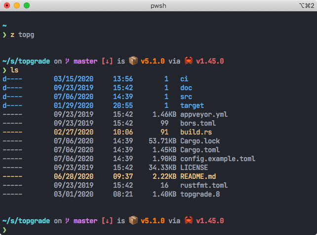

# PowerShell Configuration



A humble PowerShell configuration

# Installation

``` powershell
git clone https://github.com/r-darwish/powershell-config (Split-Path -parent $profile)
```

The modules will be installed automatically when you launch PowerShell.

[Topgrade](https://github.com/r-darwish/topgrade) can keep this configuration up to date and will also run Windows Update using PSWindowsUpdate

# Modules

* [PSCX](https://github.com/Pscx/Pscx) and [VSSetup](https://github.com/Microsoft/vssetup.powershell)
* [PSColor](https://github.com/Davlind/PSColor)
* [PSReadline](https://github.com/lzybkr/PSReadLine)
* [Jump.Location](https://github.com/tkellogg/Jump-Location) - Aliased to `z` in addition to `j`
* [PSWindowsUpdate](https://www.powershellgallery.com/packages/PSWindowsUpdate/2.1.0.1)

# Features

* Automatic installation of modules
* `Install-Chocolatey` - Install [Chocolatey](https://chocolatey.org/)
* `Install-Scoop` - Install [Scoop](https://scoop.sh/)
* `Download-Topgrade` - Download [Topgrade](https://github.com/r-darwish/topgrade) to the current
  directory
* Nice looking prompt
